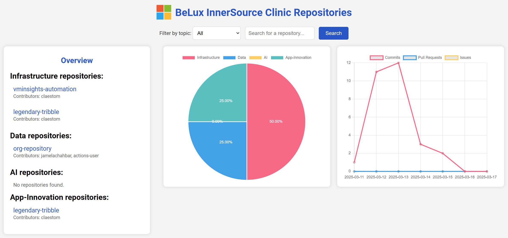

# BeLux InnerSource Clinic Repositories Dashboard

## Description
This project provides a web-based dashboard for visualizing and interacting with repositories from the BeLux InnerSource Clinic organization on GitHub. The dashboard offers an overview of the repositories, contributors, and overall work done in the organization.

**Example of the dashboard:**



## Table of Contents
- [Installation](#installation)
- [Usage](#usage)
- [Contributing](#contributing)
- [License](#license)
- [Contact](#contact)

### Installation
Instructions on how to install and set up the project locally.

```bash
# Clone the repository
git clone https://github.com/your-username/belux-innersource-clinic-dashboard.git

# Navigate to the project directory
cd belux-innersource-clinic-dashboard
```

### Usage
Open the `index.html` file in your web browser:

```bash
open index.html
```

### Contributing

1. Fork the repository.
2. Create a new branch (`git checkout -b feature-branch`).
3. Make your changes.
4. Commit your changes (`git commit -m 'Add some feature'`).
5. Push to the branch (`git push origin feature-branch`).
6. Open a pull request.

### License
This project is licensed under the MIT License.

### Contact
Your Name - tom.claes@microsoft.com

Project Link: https://github.com/your-username/belux-innersource-clinic-dashboard